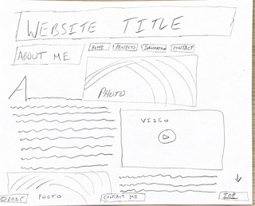
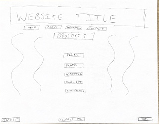
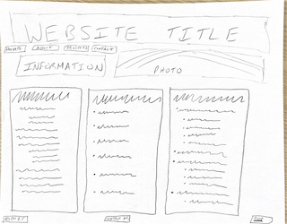
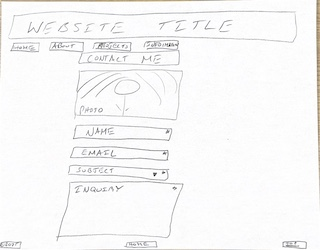

# William Neumaier's INF6420 Project

A personal portfolio/information repository website to collect and maintain various aritstic projects, intitiatives, and created reference materials.

## WIREFRAMES

As a good plan is essential to developing a strong website, I have created a few top level wireframes showcasing the basic design concepts for each main page of my website.

Website Title - Will contain the title of my website/brand

Navigation Bar - Will include buttons that lead to the other pages such as about, projects, information, and contact

Recent Updates Bar - Will contain most recent updates to the site (projects, guides, functionality, etc.) in chronological order

Photo Carousel - Will cycle through photos of the chosen showcased art for that time

Footer - Contains buttons for "Contact Me" and a fast travel to the top button, also the copyright date.

Website Title

Navigation Bar

Main Photo - A photo that I feel depicts my personality

About Me Paragraphs - A few paragraphs describing myself, my personal history, my interests, my art, and the purpose of my website.

About Me Photos/Videos - A few selected photos and videos that correspond to the information discussed in the paragraphs

Footer

Website Title

Navigation Bar

Projects Section - A selection menu where users can click different buttons to take them to various subpages of the website showcasing different types of projects from photo and video to studio art and writing.

Footer

Website Title

Navigation Bar

Header Photo - A photo that captures the feel of my idea of information and collections. 

Information Listing Boxes - A number of boxes divided into categories and sub-categories that list various links to other pages where users can browse curated timelines, media lists, lists of information resources, and other information repositories compiled by myself.

Footer

Website Title

Navigation Bar

Contact Me Form - A form with fields such as name, email address, subject of inquiry, and description.

Footer